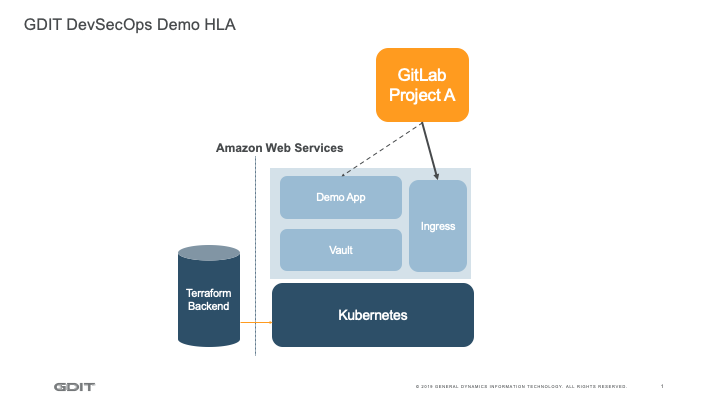

# DevSecOps Demo Platform
This application will create the DevOps Demo platform including the Kubernetes cluster and additional tools.
The high-level architecture overview shows the platform at a glance.



# Build application
The application can be used as standalone scripts, or it can be build into a Docker image. You only need to build the latter if you are not able to use the pre-built image on GitLab.

## Build locally
```shell
docker build -t challengeinfrastructure:latest .
```

## Build for GitLab
```shell
docker login registry.gitlab.com    # interactive
# or automated: 'docker login -u <username> -p <password|personal_token> registry.gitlab.com'
docker build -t registry.gitlab.com/challenge-project1/challengeinfrastructure .
docker push registry.gitlab.com/challenge-project1/challengeinfrastructure
```

# Run application
The easiest way to run this application is its Docker container. The default command for the container is the `build-all` script. It builds all components in order as outlined below under **Run manually**. But you can also run components of the application without Docker.

## Run using container
If you are using the GitLab registry, login first as described above.
```shell
# Environment variables:
# CMD (command): 'u'p or 'd'own (build direction); or use 'l' to list workspaces
docker run -it \
    -v <absolute-path-to-your-config-directory>:/platform/config \
    -e CMD="<u|d|l>" \
    rregistry.gitlab.com/challenge-project1/challengeinfrastructure
```

## Run manually
This allows you to cherry-pick the components you want to run. The application `build-all` builds all components in order, but you do not need to execute all components if not needed.
However, there are some dependencies:
1) `tfbackend` creates the Terraform backend for storing the state and should always be executed first
2) `kubernetes` creates the Kubernetes cluster, which is needed for all subsequent components
3) `dashboard` sets up the standard default Kubernetes dashboard, which is helpful to check out pods, nodes etc. but not really needed (same can be accomplished using the CLI)
4) `ingress` creates an nginx-based ingress controller and sets up the public DNS for routing (this is optional, but needed for subsequent components)

The following components are all optional, can be installed in any order and all require the `ingress` controller to be present:
- `sonatype` installs the two Sonatype products "Nexus Repository" and "Nexus IQ Server", this is helpful if you want to integrate your build process with it
- `gitlab` creates the integration between your project at `gitlab.com` and the newly created Kubernetes cluster, needed to show GitLab Auto DevOps as well as other GitLab features
- `vault` installs Hashicorp's Vault application, generates a default policy, connects Vault to the Kubernetes' Admission Controller and sets it up to inject the `init` and `sidecar` containers into our application pods (given your application uses the applicable annotations); secrets are available at `/vault/secrets`

The following tools need to be installed on your system and in the path to run this platform:
- aws ([https://docs.aws.amazon.com/cli/latest/userguide/cli-chap-install.html](https://docs.aws.amazon.com/cli/latest/userguide/cli-chap-install.html "aws cli home"))
- aws-iam-authenticator ([https://docs.aws.amazon.com/eks/latest/userguide/install-aws-iam-authenticator.html](https://docs.aws.amazon.com/eks/latest/userguide/install-aws-iam-authenticator.html "aws-iam-authenticator"))
- git ([https://git-scm.com](https://git-scm.com "git homepage"))
- yq ([https://kislyuk.github.io/yq](https://kislyuk.github.io/yq "yq homepage"))
- jq ([https://stedolan.github.io/jq](https://stedolan.github.io/jq "jq homepage"))
- terraform ([https://www.terraform.io](https://www.terraform.io "Terraform homepage"))
- kubectl ([https://kubernetes.io/docs/tasks/tools/install-kubectl](https://kubernetes.io/docs/tasks/tools/install-kubectl "kubectl homepage"))
- helm ([https://helm.sh](https://helm.sh "Helm homepage"))
- vault ([https://www.hashicorp.com/products/vault](https://www.hashicorp.com/products/vault "Vault homepage"))
